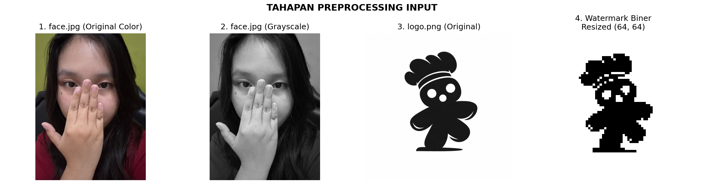
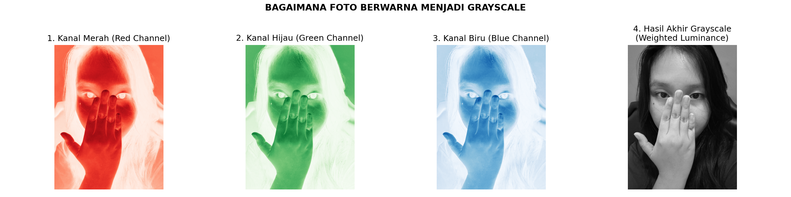
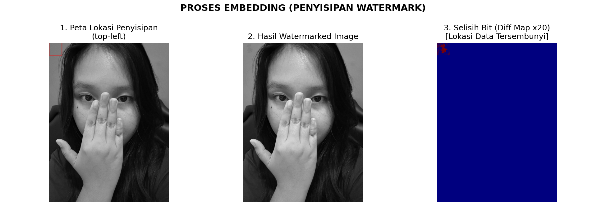
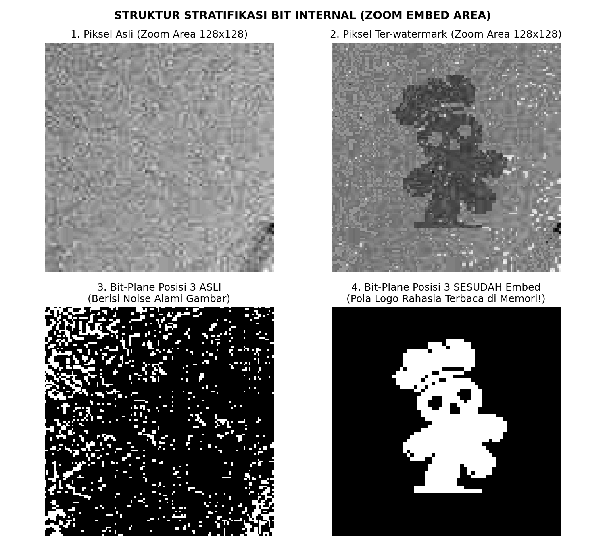
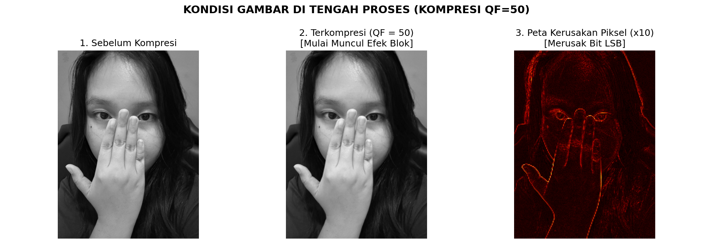
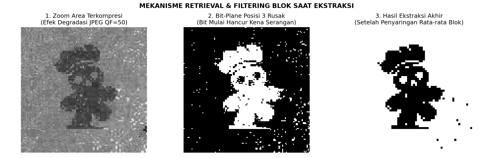
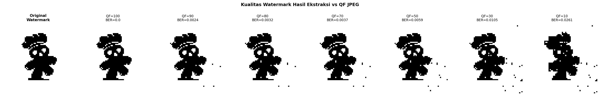
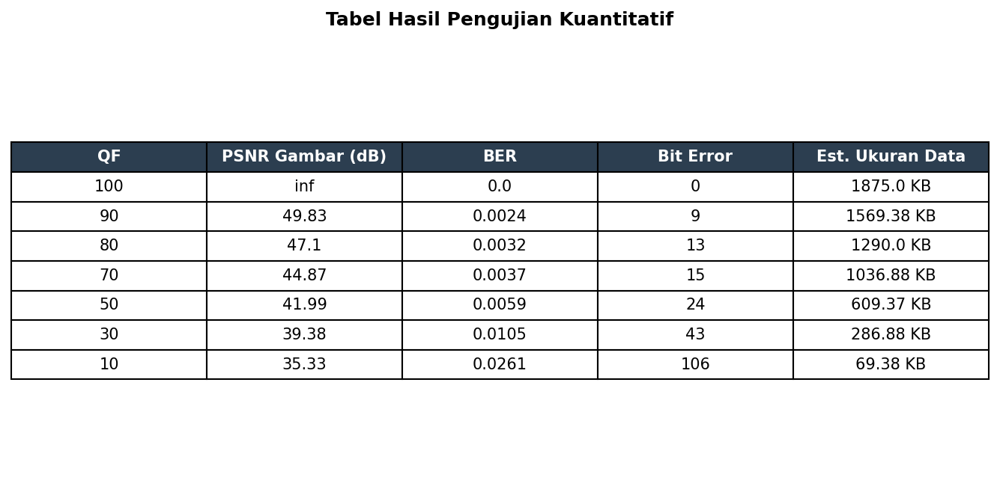

# Watermarking Project

Proyek ini merupakan implementasi teknik digital image watermarking menggunakan metode **Least Significant Bit (LSB)** dengan optimasi redundansi blok 2x2 untuk meningkatkan ketahanan watermark terhadap kompresi JPEG.

Sistem akan:

- menyisipkan watermark ke gambar,
- melakukan kompresi JPEG,
- mengekstrak watermark kembali,
- lalu mengevaluasi apakah watermark masih dapat terbaca setelah gambar dikompresi.

---

# Features

- LSB Watermark Embedding
- Redundancy Block 2x2
- Manual JPEG Compression 
- Majority Voting Extraction
- PSNR Evaluation
- BER Evaluation
- Visual Comparison Result
- Automatic Visualization Graph

---

# Project Structure

```bash
watermark_project/
│
├── images/
│   ├── face.jpg
│   └── logo.png
│
├── results/
│   ├── steps/
│   ├── compressed/
│   └── extracted/
│
├── utils.py
├── experiment_qf.py
└── README.md
```

---

# Requirements

Pastikan Python sudah terinstall.

Lalu, install dependency berikut:

```bash
pip install opencv-python numpy matplotlib pillow
```

---

# Setup Project

Clone repository:

```bash
git clone https://github.com/keisha-sakura/watermarking-sismul.git
cd watermark_project
```

Buat folder project:

```bash
mkdir images
mkdir results
mkdir results/watermarked
mkdir results/compressed
mkdir results/extracted
```

Masukkan file berikut ke folder `images/`:

- `face.jpg` → gambar utama yang akan disisipi watermark
- `logo.png` → watermark hitam putih yang akan disisipkan

---

# How It Works

## 1. Preprocessing



### Grayscale Conversion

Gambar diubah menjadi grayscale agar manipulasi bit lebih sederhana dan lebih tahan terhadap kompresi JPEG. Bisa lebih tahan terhadap kompresi karena bisa menghindari kerusakan besar saat tahap chroma subsampling. Selain itu, channel grayscale juga hanya satu sehingga prosesnya lebih sederhana. 

Untuk mengubah ke grayscale akan dibagi terlebih dahulu ke tiga channel karena satu channelnya bisa menyimpan informasi yang berbeda-beda. Lalu, untuk menghasilkan gambar grayscale yang natural untuk mata manusia, komputer akan melakukan hitungan sistematis: GRAY = 0.299 x R + 0.587 x G + 0.114 x B

```python
img = cv2.imread(path, cv2.IMREAD_GRAYSCALE)
```


---

### Resize Watermark

Watermark diresize menjadi 64x64 agar ukuran embedding tetap efisien.

```python
WM_SIZE = (64, 64)
```

---

### Binary Threshold

Watermark diubah menjadi data biner 0 dan 1 karena metode LSB bekerja langsung pada level bit.

```python
_, wm_binary = cv2.threshold(wm, 127, 1, cv2.THRESH_BINARY)
```

---

# Watermark Embedding



Pada metode LSB biasa, penyisipan selalu dilakukan pada bit posisi ke-0 sehingga perubahan sekecil apapun bisa merusak langsung gambarnya. Oleh karena itu, untuk membuatnya lebih tahan rusak, bit disisipkan di **posisi ke-3**. Posisi tersebut dipilih karena cukup rendah untuk tidak menghasilkan perubahan besar pada gambar (noise), tetapi juga cukup tinggi untuk mempertahankan nilainya dari proses kompresi.

```python
BIT_POSITION = 3
```

Setiap bit watermark disimpan ke blok 2x2 pixel sekaligus. Redundansi ini dilakukan dengan tujuan jaga-jaga jika ada 1 bit pixel yang rusak, maka masih ada 3 pixel lainnya yang menjaga informasi. 



---

# JPEG Compression Simulation

Kompresi dilakukan menggunakan pendekatan blok 8x8. Di setiap bloknya, akan dihitung nilai rata-rata lokal. Lalu, nilai dari tiap pixelnya akan dikurangi oleh nilai rata-rata dan dibagi menggunakan bobot yang diturunkan dari QF. Semakin kecil nilai QFnya, nilai variabel pembagi di dalam rumus kompresi manualnya  akan menjadi semakin besar. 

Quality Factor yang diuji:

```python
QUALITY_FACTORS = [100, 90, 80, 70, 50, 30, 10]
```

Semakin kecil nilai QF:

- kualitas gambar menurun,
- ukuran file mengecil,
- watermark semakin sulit dipertahankan.



---

# Watermark Extraction

Ekstraksi dilakukan menggunakan **sistem majority voting** pada blok 2x2. Jika mayoritas bit dalam blok bernilai 1, maka hasil ekstraksi dianggap 1.




---

# Evaluation Metrics

## PSNR (Peak Signal-to-Noise Ratio)

Digunakan untuk mengukur kualitas visual gambar setelah kompresi.

- Semakin tinggi PSNR → gambar semakin mirip dengan asli
- PSNR > 30 dB → degradasi visual sulit dilihat manusia

---

## BER (Bit Error Rate)

Digunakan untuk mengukur tingkat kesalahan bit watermark.

- BER = 0 → watermark sempurna
- BER mendekati 0.5 → watermark rusak/random

---



# Running the Experiment

Jalankan program berikut:

```bash
python experiment_qf.py
```

---

# Output Results

Seluruh hasil akan tersimpan pada folder:

```bash
results/
```

Berisi:

- gambar watermarked
- gambar hasil kompresi
- watermark hasil ekstraksi
- grafik BER vs PSNR
- tabel evaluasi

---

# Optimization Notes

Dilakukan beberapa percobaan optimasi terhadap ukuran redundansi blok.

## block_size = 2

- hasil paling stabil
- BER rendah
- watermark tetap terbaca pada QF rendah

## block_size = 3

Meskipun redundansi lebih besar, hasil justru kurang stabil karena:

- area blok lebih luas,
- lebih sering terkena boundary kompresi JPEG,
- voting mayoritas lebih mudah rusak.

Akibatnya BER meningkat pada QF rendah.

---

Keisha Sakura  
18224002
